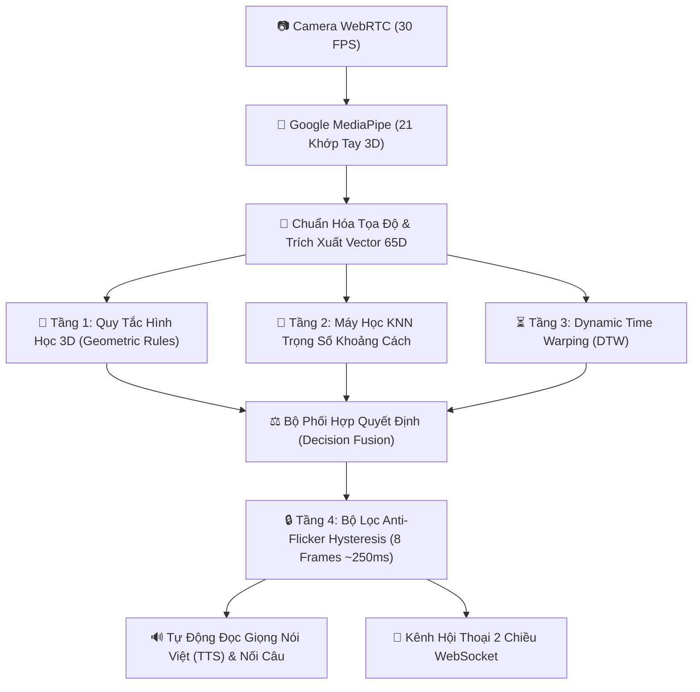

# SignLink AI - Hệ Thống Nhận Diện Ngôn Ngữ Ký Hiệu & Cử Chỉ Tay Thông Minh (PTIT)


Dự án nghiên cứu và phát triển **Hệ thống nhận diện ngôn ngữ ký hiệu và cử chỉ tay 3D thời gian thực** phục vụ báo cáo đồ án môn **Phát triển các hệ thống thông minh** tại **Học viện Công nghệ Bưu chính Viễn thông (PTIT)**.

Hệ thống được xây dựng mô hình Full-Stack hiện đại:
* **Frontend**: React 18 + TypeScript + Vite + Vanilla CSS Glassmorphism + Google MediaPipe Tasks Vision.
* **Backend**: Java Spring Boot 3.3.0 + WebSocket Real-time Broker + MongoDB Cloud Atlas.

---

## 🌟 1. Điểm Nhấn Kiến Trúc & Tiêu Chí "Hệ Thống Thông Minh"

Hệ thống được thiết kế theo kiến trúc **Tự học và Tiến hóa liên tục (Self-Evolving & Online Learning Architecture)**, bao gồm 6 phân hệ cốt lõi:



### 🧠 Các Giải Thuật Cốt Lõi Tự Lập Trình Từ Đầu (Custom Algorithms):

1. **Giải Thuật Trích Xuất Vector Đặc Trưng 65 Chiều (65D Feature Vector)**:
   * Chuyển đổi $21$ tọa độ $3\text{D } (x, y, z)$ thành vector đặc trưng $65$ chiều gồm: $42$ chiều tọa độ tương quan so với gốc cổ tay ($L_0$), $15$ chiều khoảng cách liên khớp ngón tay và $8$ chiều góc xoay hướng nghiêng bàn tay.
   * Đạt tính chất **Bất biến dịch chuyển** (*Translation Invariance*) và **Bất biến tỷ lệ** (*Scale Invariance*).

2. **Thuật Toán KNN Trọng Số Khoảng Cách Tự Viết (Custom Distance-Weighted KNN)**:
   * So sánh vector 65D hiện tại với các **Vector Mẫu (Prototypes)** trên MongoDB Cloud Atlas bằng khoảng cách Euclidean. Trọng số đóng góp của từng mẫu tỉ lệ nghịch với khoảng cách.

3. **Thuật Toán Chuỗi Thời Gian DTW (Dynamic Time Warping)**:
   * Xử lý và phân loại các cử chỉ chuyển động theo thời gian (chuỗi 15 khung hình liên tiếp) cho cử chỉ động như vẫy tay `XIN_CHAO` hay `CAM_ON`.

4. **Thuật Toán Phân Cụm K-Means Tự Viết Trên Spring Boot (Backend Centroid Clustering)**:
   * Khi số lượng mẫu do người dùng đóng góp tăng lên, backend tự động nhóm hàng trăm mẫu rác thành $K$ cụm trung tâm (*Centroids*) đại diện nhất, loại bỏ nhiễu (*outliers*) và tăng tốc độ tính toán $>30$ FPS.

5. **Bộ Lọc Anti-Flicker Hysteresis (Chống Nhiễu 8 Khung Hình)**:
   * Yêu cầu cử chỉ giữ nguyên liên tiếp $\ge 8$ khung hình ($\approx 250\text{ms}$) trước khi chốt từ vào câu, triệt tiêu hoàn toàn hiện tượng giật nháy hay nhảy nhầm từ.

---

## 🔐 2. Phân Quyền Tài Khoản (Auth & RBAC) & Lưu Trữ Cloud

Hệ thống tích hợp bộ phân quyền **Role-Based Access Control (RBAC)** bảo mật cao:

* 👑 **Tài khoản QUẢN TRỊ VIÊN (ADMIN)**:
  * **Email**: `admin@signlink.vn` | **Mật khẩu**: `admin123`
  * **Quyền hạn**: Dịch cử chỉ thời gian thực, Live Chat + **Toàn quyền Huấn luyện cử chỉ mới, Xóa mẫu rác khỏi Database Cloud, Tối ưu hóa K-Means Cloud**.
* 👤 **Tài khoản NGƯỜI DÙNG THƯỜNG (USER)**:
  * **Email**: `user@signlink.vn` | **Mật khẩu**: `user123`
  * **Quyền hạn**: Dịch cử chỉ thời gian thực, Live Chat 2 chiều, Thẻ Giao Tiếp 1-Chạm, Tùy chỉnh Cấu hình Cá nhân.

### 🗄️ Cấu Trúc Database MongoDB Cloud Atlas:

| Collection | Mục Đích Lưu Trữ |
| :--- | :--- |
| `users` | Tài khoản đăng ký, mã hóa mật khẩu bằng SHA-256 an toàn. |
| `gesture_samples` | Chuỗi 21 tọa độ khớp tay 3D ghi nhận từ người dùng. |
| `gesture_prototypes` | Các Vector đặc trưng 65D & Cụm trung tâm K-Means tối ưu. |
| `chat_messages` | Lịch sử cuộc trò chuyện Live Chat 2 chiều lưu trữ theo Mã Phòng. |
| `recognition_logs` | Nhật ký phân tích tần suất nhận diện và độ tin cậy. |

---

## 💬 3. Kênh Hội Thoại 2 Chiều Từ Xa (Live Chat Hub)

Hệ thống hỗ trợ kênh giao tiếp thời gian thực 2 chiều giữa người khiếm thính và người bình thường:

* 📡 **Kết nối WebSocket Broker thời gian thực**: Trình duyệt kết nối trực tiếp `ws://localhost:5000/ws/gestures` với độ trễ $< 10\text{ms}$.
* 🔑 **Quản lý Mã Phòng Chat Riêng (Room ID)**:
  * Cho phép đổi mã phòng linh hoạt (Ví dụ: `SẢNH_CHUNG`, `PTIT-2026`, `ROOM_123`).
  * Người dùng cùng mã phòng sẽ kết nối với nhau, lịch sử chat được lưu riêng biệt theo từng phòng trên MongoDB Cloud.
* 🎬 **Minh Họa Cử Chỉ 3D (3D Sign Avatar Player)**: Nhấp vào nút minh họa bên dưới mỗi tin nhắn để xem khung xương tay 3D múa lại cử chỉ ký hiệu tương ứng.
* 📥 **Xuất File Nhật Ký (.TXT)**: Cho phép xuất báo cáo biên bản cuộc hội thoại ra file văn bản đính kèm mốc thời gian chi tiết để phục vụ báo cáo.

---

## 📁 4. Kiến Trúc Thư Mục Dự Án

```text
PTIT_WEB_SMART_HAND/
├── frontend/                  # Ứng dụng Client (React 18 + TypeScript + Vite)
│   ├── src/
│   │   ├── components/        # HandCamera, LiveChatHub, AuthModal, UserSettingsModal, SmartSentenceBuilder
│   │   ├── utils/             # algorithm.ts (KNN, DTW, Geometric Rules), drawing.ts, api.ts
│   │   ├── types.ts           # Type Definitions
│   │   └── index.css          # Modern Glassmorphic Dark-Mode Design System
│   └── index.html             # MediaPipe WASM CDNs
├── backend/                   # Ứng dụng Server (Java Spring Boot 3.3.0)
│   ├── src/main/java/com/signlink/backend/
│   │   ├── controller/        # AuthController, GestureController, ChatController, LogController
│   │   ├── engine/            # FeatureEngine, LearningEngine, SimilarityEngine, ContextEngine, XDE
│   │   ├── websocket/         # GestureWebSocketHandler (Stream 30 FPS Broker)
│   │   ├── model/             # UserAccount, GestureSample, ChatMessageEntity, RecognitionLog
│   │   ├── repository/        # UserAccountRepository, ChatMessageRepository, GesturePrototypeRepository
│   │   └── service/           # AuthService, DatabaseSeeder, KMeansService
│   └── pom.xml                # Maven Dependencies (Java 17/23, Spring Boot 3.3.0)
├── run-backend.ps1            # Kịch bản PowerShell khởi chạy Spring Boot Backend
└── README.md                  # Tài liệu dự án
```

---

## 🚀 5. Hướng Dẫn Khởi Chạy Dự Án

### Yêu cầu tiên quyết:
* Đã cài đặt **Node.js** (v18+) và **Java JDK 17 / 23**.

---

### 🟢 Bước 1: Khởi Chạy Backend (Spring Boot 3.3.0)

Mở **PowerShell** tại thư mục gốc dự án và chạy kịch bản tự động:

```powershell
.\run-backend.ps1
```

* Backend sẽ tự động biên dịch, kết nối **MongoDB Cloud Atlas**, gieo mầm dữ liệu tài khoản mặc định và mở cổng REST API + WebSocket tại `http://localhost:5000`.

---

### 🔵 Bước 2: Khởi Chạy Frontend (React + Vite)

Mở terminal thứ hai tại thư mục `frontend`:

```bash
cd frontend
npm install
npm run dev
```

* Mở trình duyệt Chrome hoặc Edge và truy cập: `http://localhost:5173`.

---

## 🎓 6. Hướng Dẫn Trình Diễn Trước Hội Đồng Giáo Viên (Demo Steps)

1. **Đăng nhập 1-Chạm**: Bấm nút **`🔑 Đăng Nhập / Đăng Ký`** ➔ Chọn **`👑 Thử Admin (Thầy)`** hoặc **`👤 Thử User (Thành)`**.
2. **Dịch Cử Chỉ Thời Gian Thực**: Chuyển sang thẻ **Dịch Cử Chỉ & Huấn Luyện** ➔ Giơ cử chỉ tay (VD: `Chữ P` - PTIT, `Chữ T` - Thầy Cô, `Số 1` -> `Số 10`, `Bắn Tim 🫰`).
3. **Demo Trò Chuyện 2 Chiều Từ Xa**:
   * Mở 2 cửa sổ trình duyệt song song (1 bên User, 1 bên Admin trong Cửa sổ Ẩn danh `Ctrl+Shift+N`).
   * Giơ cử chỉ tay ở Cửa sổ 1 ➔ Cửa sổ 2 nẩy tin nhắn thời gian thực.
   * Nói tiếng Việt ở Cửa sổ 2 ➔ Cửa sổ 1 phát ra âm thanh đọc giọng nói tự động (TTS)!
4. **Trình Diễn Tính Năng Sửa AI & Tối Ưu K-Means Cloud**:
   * Bấm nút **`🛠️ Sửa AI`** khi đoán nhầm ➔ Gửi nhãn mới ➔ Backend Spring Boot gom cụm K-Means và cập nhật lên MongoDB Cloud Atlas ngay lập tức!
5. **Xuất Nhật Ký Báo Cáo**: Bấm nút **`📥 Xuất Nhật Ký (.TXT)`** tại Kênh Live Chat để tải về biên bản báo cáo cuộc họp!

---

*Đồ án được phát triển bởi **Thành Phạm (Sinh viên PTIT)** phục vụ học phần Phát triển Hệ thống Thông minh.*
